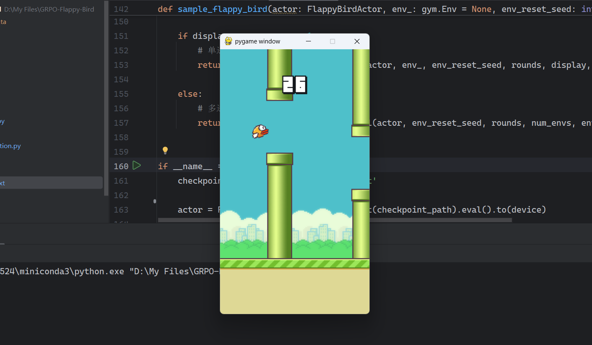

# GRPO-Flappy-Bird



## 简介

这是在[Flappy Bird环境](https://github.com/markub3327/flappy-bird-gymnasium)下对[GRPO强化学习算法](https://arxiv.org/abs/2402.03300)的PyTorch实现。

## 训练你的Flappy Bird Agent

### 1. 克隆仓库并创建环境

运行

```
git clone https://github.com/DeswV/GRPO-Flappy-Bird.git
cd GRPO-Flappy-Bird
pip install -r requirements.txt
```

### 2. 第一阶段：监督学习

开始强化学习之前最好有一个比较好的初始模型作为起点。我们可以通过在人类玩游戏的数据上用监督学习训练一个Agent来作为初始模型。

运行以下脚本来记录你的游玩数据：

```
python manual_annotation.py
```

游玩数据将保存在`human_play_data`文件夹下。建议剔除质量较差的数据，最终得到10条左右质量比较好的数据。

现在运行以下脚本来启动监督学习：

```
python pretraining.py
```

你可以修改该文件主函数中定义的训练参数。模型将保存在`outputs/pretrained_models`下，Tensorboard记录保存在`logs/pretraining`下。建议根据记录的`avg_reward`来挑选最好的模型作为强化学习的初始模型。

### 3. 第二阶段：强化学习

打开并编辑`grpo_training.py`的主函数，将你挑选的监督学习模型的路径填在这里（第216行）：

```python
actor_checkpoint_path='outputs/pretrained_models/[your checkpoint here]',
```

然后运行训练脚本：

```
python grpo_training.py
```

模型将保存在`outputs/grpo_training`下，Tensorboard记录保存在`logs/grpo_training`下。

### 4. 观看训练好的Agent游玩Flappy Bird

打开并编辑`sampling.py`的主函数（第161行），将检查点路径修改为你训练好的模型地址（或者就使用这个模型）：

```python
checkpoint_path = 'models/actor_grpo.pt'
```

然后运行该脚本：

```
python sampling.py
```

